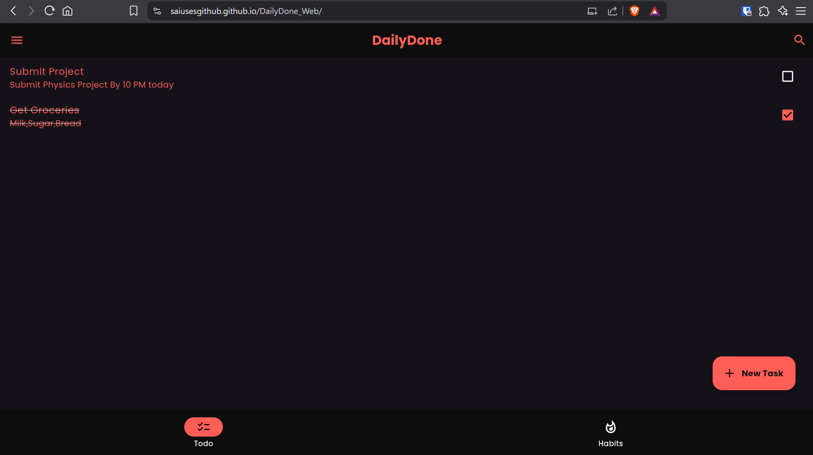
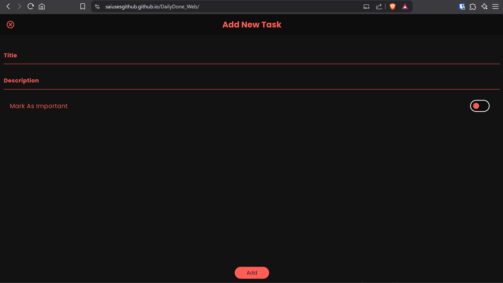
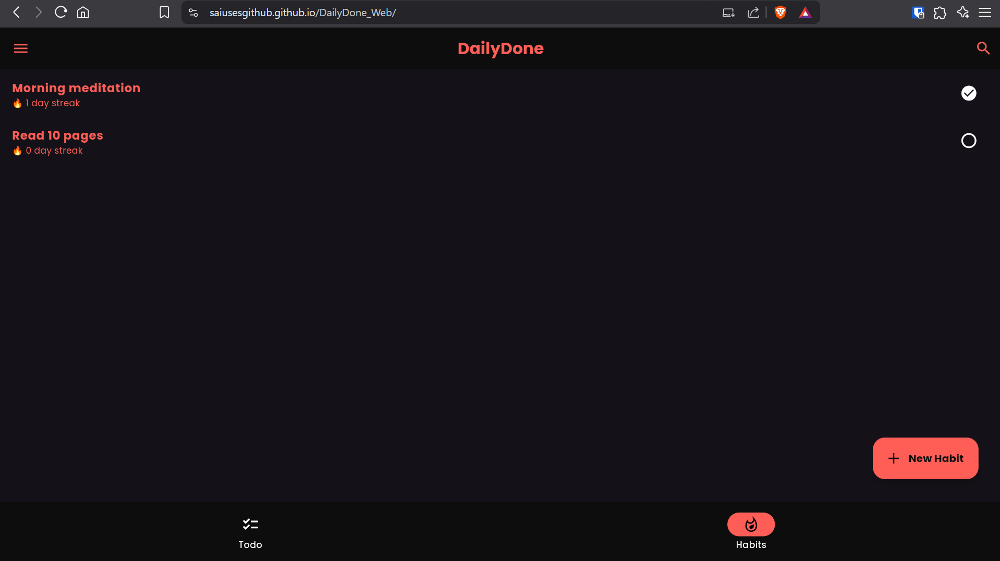

# 🧠 DailyDone – Flutter Web Todo & Habit Tracker

DailyDone is a sleek, dark-themed **Todo List + Habit Tracker** built using Flutter and Hive. It helps users manage daily tasks and build consistent habits – all in your browser, with persistent storage via IndexedDB.

---

## 🚀 Features

- ✍️ Add, delete, and complete tasks with animated interactions
- 🔥 Habit tracking with automatic streak calculation
- 🌈 Dark theme with red-peach accent
- ✅ Local persistence using Hive on web (via IndexedDB)
- 💡 Responsive layout for mobile and desktop screens

---

## 📸 Screenshots

### 🧠 Home Screen

### ✔️ Todo List

### ➕ Add New Task

### 📈 Habit Tracker with Streaks

---

## 🛠️ Built With

- [Flutter](https://flutter.dev/) — Cross-platform UI toolkit
- [Hive](https://pub.dev/packages/hive) — Lightweight & blazing fast NoSQL DB
- [Hive Web](https://pub.dev/packages/hive_web) — Browser-based IndexedDB adapter
- Hosted on **GitHub Pages**

---

## 🌐 Try It Live

👉 **[Click here to open the app](https://saiusesgithub.github.io/DailyDone_Web/)**

---

## 📲 Full App (Android / Windows Support)

Want to try the full version of the app for **Android or desktop (Windows)**?

👉 **[Here is the GitHub repo for the full Flutter app](https://github.com/saiusesgithub/daily_done)**  
*(Includes platform support for mobile and desktop)*

---
## 📄 License
This project is open source and available under the MIT License.

---

## 🙌 Author

Made with 💙 by @saiusesgithub
---
After placing your screenshots:
2. Add the images like `home.png`, `todo.png`, `habits.png`
3. Commit & push
